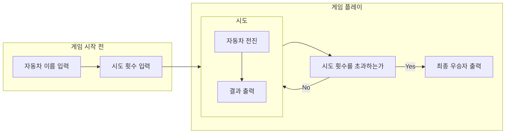

## 플로우차트

---

## 요구사항

---

1. 자바 코드 컨벤션 지키기
2. indent depth가 3을 넘지 않도록 하기
3. else 예약어 사용하지 않기
4. 3항 연산자 사용하지 않기
5. 각 메서드는 한 가지 일만 하도록 구현하기
6. 모든 기능을 TDD로 구현하기
7. **모든 원시 값과 문자열을 포장하기**
8. **일급 컬렉션 사용하기**

## 체크리스트

---

-[ ] For 을 Stream 으로 최대한 변경했는가
-[ ] 컨벤션에 맞춰 작성하였는가
-[ ] MVC 패턴에 적합한 구조를 작성했는가
-[ ] 적절한 exception 처리를 했는가
-[ ] 불변 변수에 대해서 final 예약어를 사용했는가
-[ ] 자바에서 제공하는 기능을 최대한 활용했는가
-[ ] 사용한 기능에 대해서 제대로 이해했는가
-[ ] 매직 넘버를 사용하지 않았는가
-[ ] 다른 사람들의 코드도 리뷰해 보았는가
-[ ] 블로깅은 했는가.....