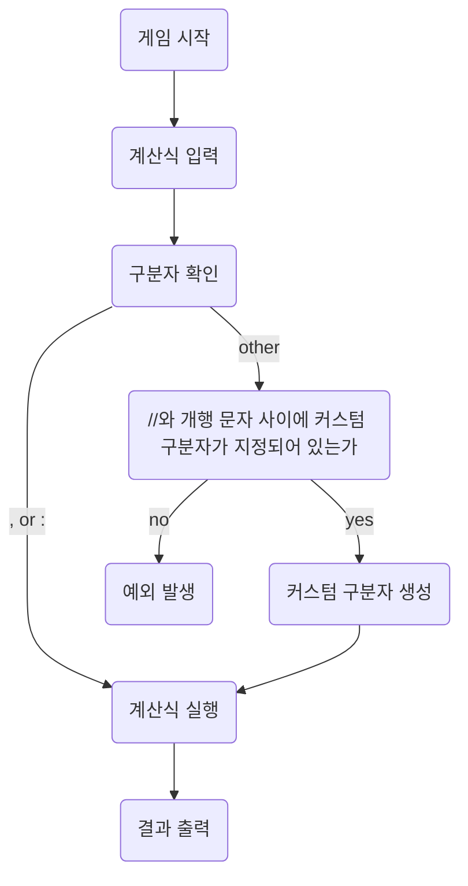

## 체크리스트

---

1. For 을 Stream 으로 최대한 변경했는가
2. Ctrl+Shift+Alt+L (코드 포맷팅)이 적용되었는가
3. 엔터를 하나씩만 했는가
4. 자바 컨벤션에 부합한가
5. if 문은 한 줄이라도 예외없이 중괄호를 씌웠는가
6. MVC 패턴에 적합한 구조를 작성했는가
7. 적절한 exception 처리를 했는가
8. 불변 변수에 대해서 final 예약어를 사용했는가
9. 변수명을 올바른 규칙대로 작성했는가
10. 자바에서 제공하는 기능을 최대한 활용했는가
11. 사용한 기능에 대해서 제대로 이해했는가
12. 매직 넘버를 사용하지 않았는가
13. 다른 사람들의 코드도 리뷰해 보았는가

- 컨벤션(eof 엔터, 기타 자바 컨벤션)을 자동으로 맞춰주는 인텔리J 설정을 마쳤는가

## 플로우차트

---

